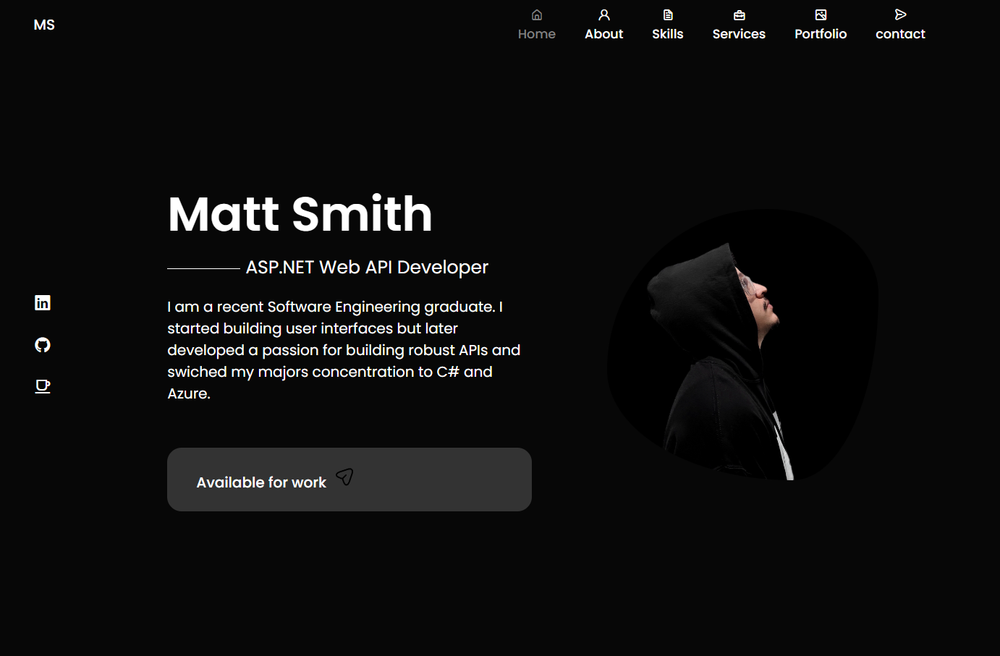
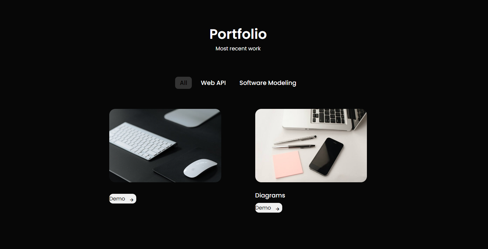

##Professional Portfolio

I built this Portfolio to showcase my educational background and experience in backend development with the provided Project section.

## Technologies used
* JavaScript
* CSS
* HTML
* React

## Visit here:
https://mattsmithportfolio.com
   
When the application launches, it should look like this.
   

## My most current work:
Showcasing API Development, Diagrams, and Swagger UI for testing the endpoints.

## What team members have said about me:
In this section, team members from my previous Internship at Bosch Automotive Service Solutions wrote a review of my work ethic, proficiencies, and challenges overcome.

